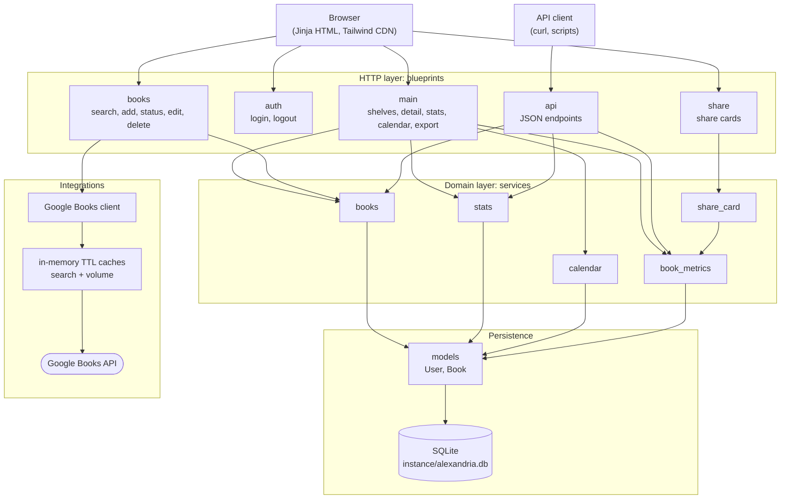
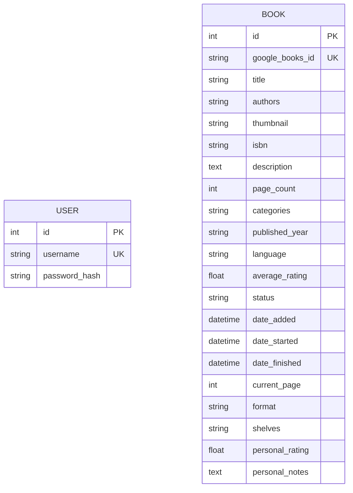

# Architecture

Alexandria is a layered, server-rendered Flask application with a single SQLite
database. HTTP concerns live in blueprints, business rules in services, and
persistence in models. Templates never query the database directly; they render
context built by the services.

## Layers



| Layer | Package | Responsibility |
| :--- | :--- | :--- |
| Blueprints | `alexandria/blueprints/` | Parse the request, call services, render a template or return JSON. No business rules. |
| Services | `alexandria/services/` | Filtering and pagination, status transitions, stats aggregation, calendar events, per-book metrics, share-card data. Pure Python over models. |
| Models | `alexandria/models.py` | SQLAlchemy `User` and `Book`, plus `to_dict()` and cover URL helpers. |
| Integrations | `alexandria/integrations/` | The Google Books client and its caches. |
| Utilities | `alexandria/utils/` | Cover URL resolution (Google Books and Open Library fallbacks), language names, HTML stripping. |
| Bootstrap | `alexandria/bootstrap.py` | Instance folder, librarian user, optional metadata refresh at startup. |

`create_app()` in `alexandria/__init__.py` loads `.env`, applies
`alexandria/config.py`, initialises the extensions (`db`, `login_manager`,
`csrf`, `limiter`, `migrate`), registers the blueprints and error handlers, and
runs the startup bootstrap.

### Blueprints

| Blueprint | Role |
| :--- | :--- |
| `main` | Home (shelves), book detail, stats, calendar, CSV/JSON export |
| `auth` | Login (rate limited to 10 POSTs per minute) and logout |
| `books` | Google Books search and the mutating actions: add, change status, finish, edit, delete. Login required. |
| `api` | Read-only JSON API, optionally protected by `READING_API_TOKEN`. See [API.md](API.md). |
| `share` | Renders the shareable card for a book from its metrics |

### Caches

- **Google Books caches**: two in-process dictionaries (search results and
  volume details) with a monotonic-clock TTL set by
  `GOOGLE_BOOKS_CACHE_TTL_SECONDS` (`0` disables them). They exist to stay under
  Google's anonymous quota and to make repeat searches instant. Because they
  live in process memory, the app runs a single gunicorn worker so there is one
  coherent cache.
- **Browser caching** of the Tailwind CDN script and fonts is handled by the
  browser; there is no server-side page cache.

## Request flows

### Rendering the shelves (`GET /`)

1. The `main` blueprint reads the query string (search text, status, category,
   page).
2. `services/books` filters and paginates the collection and groups books by
   status and shelf.
3. The template renders each group as a wooden shelf; covers use
   `Book.cover_url`, falling back to the Open Library cover by ISBN.

### Adding a book (`POST /add/<google_books_id>`)

1. Flask-Login checks the session; CSRFProtect validates the token.
2. If the volume is already in the library (`google_books_id` is unique), the
   user is redirected to the existing book.
3. Otherwise the Google Books client fetches the volume. A cache hit returns
   immediately; a miss calls the API and stores the result.
4. `services/books.add_book_from_api_details` creates the `Book` with the
   requested status and commits.
5. The user is redirected to the book with a flash message.

### Public API call (`GET /api/books/<id>`)

1. The `api` blueprint checks the optional bearer token against
   `READING_API_TOKEN`; a mismatch returns `401 {"error": "Unauthorized"}`.
2. The book is loaded and `services/book_metrics` computes days reading, pages
   per day, progress percentage and ratings.
3. The blueprint returns `Book.to_dict()` plus `external_links` and `metrics`.

### Share card

The `share` blueprint loads a book, `services/book_metrics` provides the numbers
and `services/share_card` shapes them into a card (title, author, cover,
rating, key metrics) that the template renders as a standalone, screenshot-ready
page.

## Data model



`User` holds the librarian account. `Book` has no foreign key to `User`:
Alexandria is single-user today.

| Field | Notes |
| :--- | :--- |
| `google_books_id` | Unique when present; books can also be created without one |
| `title`, `authors`, `isbn`, `description`, `page_count`, `categories`, `published_year`, `language`, `average_rating`, `thumbnail` | Metadata fetched from Google Books. `categories` is a comma-separated string. `average_rating` is the public rating. |
| `status` | One of `reading`, `finished`, `tbr`, `paused`, `dnf` (see `alexandria/constants.py`) |
| `date_added` | When the book entered the library (UTC) |
| `date_started` | When reading began; used for days reading and pages per day |
| `date_finished` | Set when the book is finished; drives the calendar and per-year stats |
| `current_page` | Reading progress; with `page_count` gives the progress percentage |
| `format` | `paper`, `ebook` or `audiobook` |
| `shelves` | Comma-separated custom shelf names, stored like `categories` |
| `personal_rating`, `personal_notes` | Your private rating and notes |

Datetimes are stored naive in SQLite and treated as UTC; `services/stats.as_utc`
normalises them before comparison. In JSON output dates are `YYYY-MM-DD`.

## Migrations

Schema changes go through Flask-Migrate (Alembic). The migrations live in
`migrations/versions/` and the Docker entrypoint runs `flask db upgrade` before
gunicorn starts.

Workflow for a model change:

```bash
# 1. edit alexandria/models.py
uv run flask --app app db migrate -m "describe the change"
# 2. review the generated file in migrations/versions/
uv run flask --app app db upgrade
make test
```

Guidelines:

- Always review autogenerated migrations; SQLite cannot alter most column
  properties in place, so renames and type changes need `batch_alter_table`.
- Adding nullable columns (as `current_page`, `date_started`, `format` and
  `shelves` were) is safe for existing data.
- Commit the migration together with the model change.
- `bootstrap.init_database()` also calls `db.create_all()` at startup so a fresh
  database works without running migrations; migrations remain the source of
  truth for upgrading an existing database.

## Concurrency and deployment

SQLite serialises writers, and the Google Books caches are per process, so the
container runs `gunicorn -w 1`. Migrations run in the entrypoint before the
server forks, avoiding concurrent schema changes. Scaling beyond one worker means
replacing SQLite with PostgreSQL and moving the caches to a shared store.

## Testing strategy

Tests live in `tests/` and use Flask's test client against a throwaway SQLite
database (`tests/conftest.py`). Services are tested directly; blueprints are
tested through HTTP; the Google Books client is tested with mocked `requests`
calls, so the suite never touches the network.
